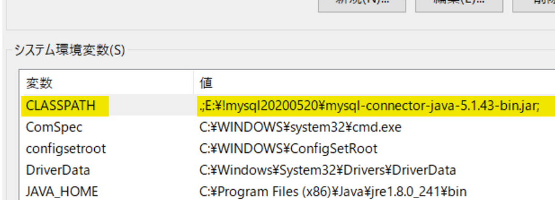
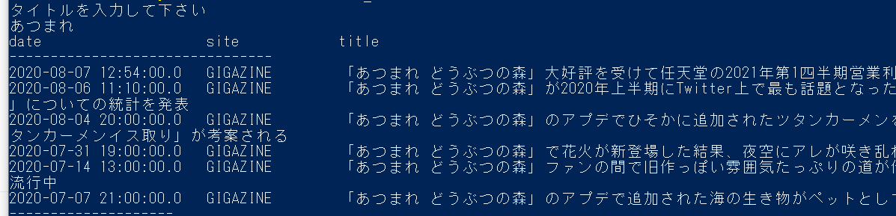
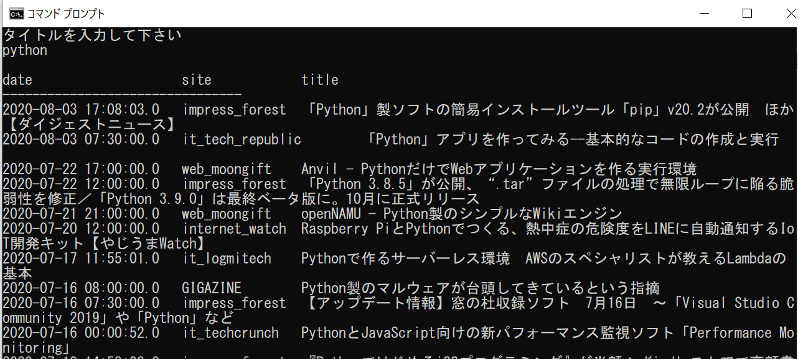
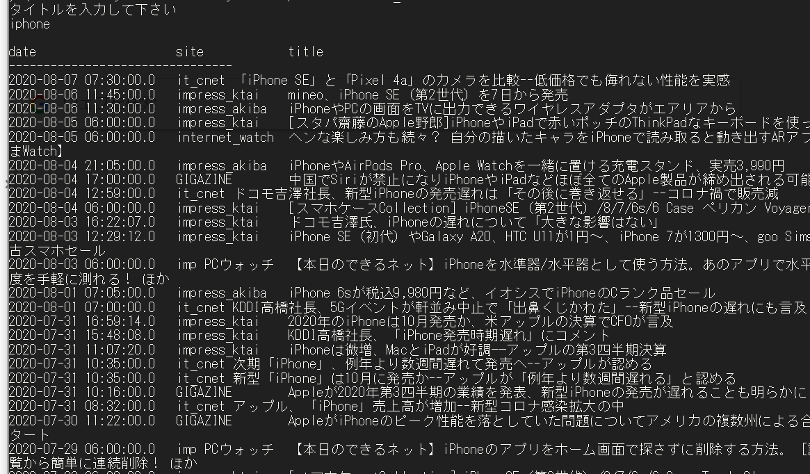

# JavaMySQLSearch
ドキュメント（仮）

# 【準備】JDBCドライバ（jarファイル）
## Windows（環境変数へ設定）



```
.(ドット);（セミコロン）[フルパス];（セミコロン）

.;E:\!mysql20200520\mysql-connector-java-5.1.43-bin.jar;
```
```
//jarファイルは任意の場所に置いてください
//例
.;C:\Program Files\Java\mysql-connector-java-5.1.43-bin.jar;

```

## Linux(CentOS)

# コンパイル
```Java
//コンパイル
javac DbSearch.java
```
```Java
//実行
java DbSearch
```

# 使用例
#### Windows(PowerShell)



#### Windows(コマンドプロンプト)


#### Linux(CentOS)


# MySQL

# SQL文解説
```SQL
SELECT title,date, 'Yahoo Japan' AS site_name 
FROM test_news1 
WHERE title LIKE " + "'%" + str + "%' 
UNION ALL 
SELECT title,date, 'NHK News' AS site_name 
FROM test_news2 
WHERE title LIKE " + "'%" + str + "%' 
ORDER BY date DESC 
LIMIT 50
```

# ToDo
- 設定ファイルの外部ファイル化
- 一定の文字数を超えたら、省略する（SQL文）
